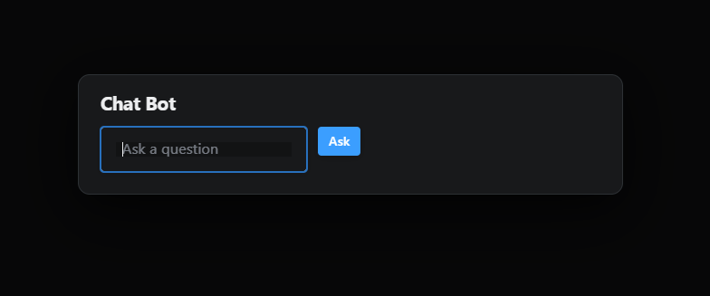

# Chatbot in Reflex

This is a chatbot project developed with Reflex and the OpenAI API. The goal of this project is to create an interactive and efficient chatbot that can answer questions and engage in conversations.



## Features

- **Asynchronous:** Uses `AsyncOpenAI` to handle responses efficiently without blocking the user interface.

## Requirements

- Python 3.7 or higher
- pip

## Installation

1. Clone this repository:
   ```bash
   git clone https://github.com/Nestor-DS/chatRx.git
   cd chatRx
   ```

2. Create a virtual environment:
   ```bash
   # For Windows:
   py -3 -m venv .venv
   .venv\Scripts\activate
   ```

3. Install the dependencies:
   ```bash
   pip install -r requirements.txt
   ```

## Configuration

1. Obtain an API key from OpenAI by signing up at [OpenAI](https://beta.openai.com/signup/).

2. Access the `State.py` file and place your API key:
   ```python
   os.environ["OPENAI_API_KEY"] = 'your_api_key'
   ```

## Running the Program

1. Run the application:
   ```bash
   reflex run
   ```